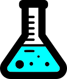
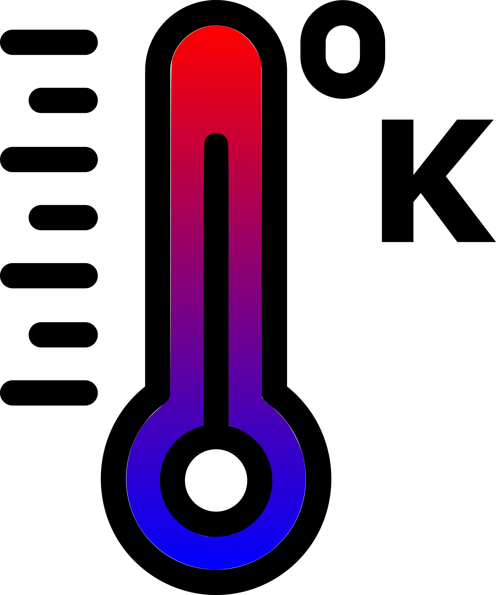

#  XP 1-1

<span style="float:left;width:100px">  </span>

This set of experiments is concerned with the structure and temperature properties (ie crystalisation) of Amorphous Solid Water (ASW).

## Sample List

- **Total number of samples**: 23
- **Classification**
    - 20K deposition: 
    - High T deposition:

### 20K Deposition

:::::{div} full-width
::::{card-carousel} 3

:::{card}
:class-header: bg-light
:margin: 3
<span style="float:right">  </span>**2020_09_15**
^^^

-  20K

-  Step

-  x

- [](https://deugz.github.io/nb-phd/_build/html/Notes/Data_Notes/XP-1_1/2020_09_15/2020_09_15.html)

***

**Data Managment**

- &#9989; Reduction

- Processing

- Analysis 
    - [Control XP](https://deugz.github.io/nb-phd/_build/html/Notes/Data_Notes/Analysis/Control_Experiments/Control_experiments.html)

- Review


:::

:::{card}
:class-header: bg-light
:margin: 3

<span style="float:right">  </span>**2020_09_16**
^^^

-  20K

-  Steps - 130K

-  none

- [](https://deugz.github.io/nb-phd/_build/html/Notes/Data_Notes/XP-1_1/2020_09_16/2020_09_16.html)


***

**Data Managment**

- Reduction

- Processing

- Analysis (link to)

- Review


:::

:::{card}
:link: 2020_09_17/2020_09_17.html
:class-header: bg-light
:margin: 3

<span style="float:right">  </span>**2020_09_17**
^^^

-  20K

-  Steps - 130K

-  none

- [](https://deugz.github.io/nb-phd/_build/html/Notes/Data_Notes/XP-1_1/2020_09_17/2020_09_17.html)


***

**Data Managment**

- Reduction

- Processing

- Analysis (link to)

- Review


:::

:::{card}
:link: 2020_09_21/2020_09_21.html
:class-header: bg-light
:margin: 3

<span style="float:right">  </span>**2020_09_21**
^^^

-  20K

-  Steps


-  none

- [](https://deugz.github.io/nb-phd/_build/html/Notes/Data_Notes/XP-1_1/2020_09_21/2020_09_21.html)


***

**Data Managment**

- Reduction

- Processing

- Analysis (link to)

- Review

:::

:::{card}
:link: 2020_09_24/2020_09_24.html
:class-header: bg-light
:margin: 3

<span style="float:right">  </span>**2020_09_24**
^^^

-  20K

-  Steps 


-  none

***

**Data Managment**

- Reduction

- Processing

- Analysis (link to)

- Review

:::

:::{card}
:link: 2020_09_28/2020_09_28.html
:class-header: bg-light
:margin: 3

<span style="float:right">  </span>**2020_09_28**
^^^

-  20K

-  Steps 


-  none

***

**Data Managment**

- Reduction

- Processing

- Analysis (link to)

- Review


:::

:::{card}
:link: 2020_10_14/2020_10_14.html
:class-header: bg-light
:margin: 3

<span style="float:right">  </span>**2020_10_14**
^^^

-  20K

-  Steps 


-  none

***

**Data Managment**

- Reduction

- Processing

- Analysis (link to)

- Review


:::

:::{card}
:link: 2020_10_15/2020_10_15.html
:class-header: bg-light
:margin: 3

<span style="float:right">  </span>**2020_10_15**
^^^

-  20K

-  Steps 


-  none

***

**Data Managment**

- Reduction

- Processing

- Analysis (link to)

- Review

:::

:::{card}
:link: 2020_10_22/2020_10_22.html
:class-header: bg-light
:margin: 3

<span style="float:right">  </span>**2020_10_22**
^^^

-  20K

-  Steps 


-  none

***

**Data Managment**

- Reduction

- Processing

- Analysis (link to)

- Review

:::

:::{card}
:link: 2020_10_30/2020_10_30.html
:class-header: bg-light
:margin: 3

<span style="float:right">  </span>**2020_10_30**
^^^

**Parameters**
<br>

-  20K

-  Steps

-  none

***

**Data Managment**

- Reduction

- Processing

- Analysis (link to)

- Review


:::

:::{card}
:link: 2020_11_16/2020_11_16.html
:class-header: bg-light
:margin: 3

<span style="float:right">  </span>**2020_10_30**
^^^

-  20K

-  Steps 


-  none

***

**Data Managment**

- Reduction

- Processing

- Analysis (link to)

- Review

:::

::::
:::::

### Higher T deposition

:::::{div} full-width
::::{grid} 1 1 2 5
:class-container: text-center
:gutter: 4

:::{grid-item-card}
:link: 2020_09_15/2020_09_15.html
:class-header: bg-light
<span style="float:right">  </span>**2020_09_15**
^^^

-  20K


-  Steps - 130K


-  none

***

**Data Managment**

- Reduction

- Processing

- Analysis (link to)

- Review


:::

:::{grid-item-card}
:link: 2020_09_16/2020_09_16.html
:class-header: bg-light

<span style="float:right">  </span>**2020_09_16**
^^^

-  20K

-  Steps - 130K


-  none

***

**Data Managment**

- Reduction

- Processing

- Analysis (link to)

- Review


:::

:::{grid-item-card}
:link: 2020_09_17/2020_09_17.html
:class-header: bg-light

<span style="float:right">  </span>**2020_09_17**
^^^

-  20K

-  Steps - 130K


-  none

***

**Data Managment**

- Reduction

- Processing

- Analysis (link to)

- Review


:::

:::{grid-item-card}
:link: 2020_09_21/2020_09_21.html
:class-header: bg-light

<span style="float:right">  </span>**2020_09_21**
^^^

-  20K

-  Steps - 130K


-  none

***

**Data Managment**

- Reduction

- Processing

- Analysis (link to)

- Review

:::

:::{grid-item-card}
:link: 2020_09_24/2020_09_24.html
:class-header: bg-light

<span style="float:right">  </span>**2020_09_24**
^^^

-  20K

-  Steps - 130K


-  none

***

**Data Managment**

- Reduction

- Processing

- Analysis (link to)

- Review

:::

:::{grid-item-card}
:link: 2020_09_28/2020_09_28.html
:class-header: bg-light

<span style="float:right">  </span>**2020_09_28**
^^^

-  20K

-  Steps - 130K


-  none

***

**Data Managment**

- Reduction

- Processing

- Analysis (link to)

- Review


:::

:::{grid-item-card}
:link: 2020_10_14/2020_10_14.html
:class-header: bg-light

<span style="float:right">  </span>**2020_10_14**
^^^

-  20K

-  Steps - 130K


-  none

***

**Data Managment**

- Reduction

- Processing

- Analysis (link to)

- Review


:::
::::
:::::


### 2020_09_15

```{note} 
- Page: &#9989; 
- Redu: &#9989; 
- Proc: &#9989; 
```

First Sample produced

### 2020_09_16

```{note} 
- Page: &#9989; 
- Redu: &#9989; 
- Proc: &#9989; 
```

Sample description

### 2020_09_17

```{note} 
- Page: &#9989; 
- Redu: &#9989; 
- Proc: &#9989; 
```
Sample description

### 2020_09_21

```{note} 
- Page: &#9989; 
- Redu: &#9989; 
- Proc: &#9989; 
```
Sample description

### 2020_09_24

```{note} 
- Page: &#9989; 
- Redu: &#x274C;
- Proc: &#x274C; 
```
Sample description


### 2020_09_28

```{note} 
- Page: &#9989; 
- Redu: &#9989; 
- Proc: &#9989; 
```
Sample description

### 2020_10_14

```{note} 
- Page: &#9989; 
- Redu: &#9989; 
- Proc: &#9989; 
```
Sample description


### 2020_10_15

```{note} 
- Page: &#9989; 
- Redu: &#x274C; 
- Proc: &#x274C; 
```
Sample description


### 2020_10_22

```{note} 
- Page: &#9989; 
- Redu: &#9989; 
- Proc: &#9989; 
```
Sample description


### 2020_10_30

```{note} 
- Page: &#9989; 
- Redu: &#x274C;
- Proc: &#x274C; 
```
Sample description


### 2020_11_16

```{note} 
- Page: &#9989; 
- Redu: &#9989; 
- Proc: &#9989; 
```
Sample description


### 2020_11_19

```{note} 
- Page: &#9989; 
- Redu: &#9989; 
- Proc: &#9989; 
```
Sample description


### 2020_11_23

```{note} 
- Page: &#9989; 
- Redu: &#9989; 
- Proc: &#9989; 
```
Sample description


### 2020_11_26

```{note} 
- Page: &#9989; 
- Redu: &#x274C;
- Proc: &#x274C; 
```
Sample description

### 2020_11_30

```{note} 
- Page: &#9989; 
- Redu: &#x274C;
- Proc: &#x274C; 
```
Sample description


### 2021_01_21

```{note} 
- Page: &#9989; 
- Redu: &#x274C;
- Proc: &#x274C; 
```
Sample description


### 2021_01_25

```{note} 
- Page: &#9989; 
- Redu: &#x274C;
- Proc: &#x274C; 
```
Sample description


### 2021_02_09

```{note} 
- Page: &#9989; 
- Redu: &#x274C;
- Proc: &#x274C; 
```
Sample description


### 2021_04_26

```{note} 
- Page: &#9989; 
- Redu: &#x274C; 
- Proc: &#x274C; 
```
Sample description


### 2021_05_08

```{note} 
- Page: &#9989; 
- Redu: &#9989; 
- Proc: &#9989; 
```
Sample description


### 2021_05_13

```{note} 
- Page: &#9989; 
- Redu: &#9989; 
- Proc: &#9989; 
```
Sample description


### 2021_05_24

```{note} 
- Page: &#9989; 
- Redu: &#9989; 
- Proc: &#9989; 
```
Sample description


### 2021_07_13

```{note} 
- Page: &#9989; 
- Redu: &#9989; 
- Proc: &#9989; 
```
Sample description
