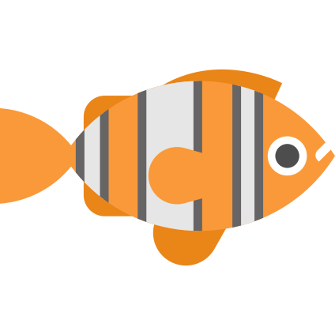

```{image} Documents/3Dsuccess.png
:alt: 3D cool plot
:width: 650px
:align: center
```

# Stairway to Heaven

:::::{margin} 
::::{grid} 1
:::{grid-item-card} 
:img-top: Documents/SFP-logo.png
:link: https://deugz.github.io/nb-master/_build/html/intro.html
^^^
**Vincent Deguin**
:::
::::
:::::


***

<p class="emphase"><strong>Kinetics and Morphologie Changes of Amorphous Solid Water upon Crystalisation (and influence of an imuprity, ethane)</strong></p>

<p class="emphase">V. Deguin, A. Dawes (S. Green, R. Moat)</p>


- **Topics**: Experimental Astrophysics, Astrochemistry
- **Techniques**: mid-IR Spectroscopy
- **Job**: PhD Part II
<br>
<br>
- **Info**:  -  -  - 


***


## Abstract

Water ice is ubiquitously present on the surface of interstellar dust grains and is thought to play a key role in the interstellar medium chemistry, where more than 200 molecules have been detected (PhD part 2 - this work). Ice is also a key ingredient enhancing aggregation of micrometre dust in protoplanetary disks (PhD part 1). Investigations of those processes rely on the production of laboratory analogues and have been an intense focus of research since the discovery of Amorphous Solid Water (ASW) in 1935 by Burton and Oliver obtained from water vapor deposition on a cold surface (< 70 K). Subsequent work has put into evidence the highly porous and metastable (with respect to the thermodynamically stable crystaline ice) structure of ASW. However, despite mentions of a glass transition, it is not yet clear how ASW transforms to crystalline ice. Having such knowledge is crucial with the launch of James Web Space Telescope (JWST), that will give scientists unprecedented spatial and spectral resolution that could potentially resolve the two polymorphs.

- Infrared Spectroscopy

- Resolve the OH stretching mode 

- Well established Experiment

- New methodology - long isotherm scan to resolve subtle changes, kinetics over an extended period of time

- Presence of impurities will be investigated


## Content

``````{margin} 

`````{admonition} **My Corner**
:class: seealso

<br>
<br>

:::{grid-item-card}
:link: Notes/Daily_Log.html
:class-header: bg-light
**Daily Notes** 
^^^
Daily notes 
- Day plans
- Stick outputs


- reviewed weekly with Anita

:::

<br>
<br>

:::{grid-item-card}
:link: Notes/Monthly_Dashbord.html
:class-header: bg-light
**Monthly Dashboard** 
^^^
Implemented with major progress. 


- Reviewed Weekly w/ Anita and 
- Discuss w/ the whole supervision team at the end of the Month (then Archive).

:::

<br>
<br>

:::{grid-item-card}
:link: Notes/Thesis_Notes/Intro.html
:class-header: bg-light
**Organisation**
^^^
- Gant Charts
- To-do lists
- Productivity tools
- Admin
:::


<br>
<br>

**Support**

<br>
<br>

 [Patreon](https://www.patreon.com/Science_for_the_People)

<br>

or

<br>

<script type='text/javascript' src='https://storage.ko-fi.com/cdn/widget/Widget_2.js'></script><script type='text/javascript'>kofiwidget2.init('Buy me a coffee', '#317315', 'O4O6EZO78');kofiwidget2.draw();</script> 

<br>
<br>

`````

``````


<h3><strong>&#187;  <u>Thesis </u></strong></h3>

Chapters in bold (+ &#9999;) on the left menu are **Thesis Chapters**, Other pages in the relevant sections are secoundary materials. Chapter 6 and 7 are located in another book (differrent project). 

<h4><strong>Corpus</strong></h4>

<h5>Part 1: Stairway to Heaven</h5>


- [Chapter 1.A](Thesis_JB/Chapter1/Chapter1) : **Introduction**
<br>
<br>
    - 1.1 The Dust cycle in the Galaxy
<br>
<br>
    - 1.2 Synergy Between Experiments, Modelling and Observation in Astronomy through the Prism of Ice
<br>
<br>   
    - 1.3 Amorphous Ices in the Laboratory
<br>
<br>
    - 1.4 Ice Processing in the Context of Planet Formation
<br>
<br>
    - 1.5 Thesis Motivation and Aim
<br>
<br>
    - 1.6 Thesis Outline
<br>
<br>
- [Chapter 2.B](Thesis_JB/Chapter2/Chapter2) : **Method**
<br>
<br>
    - 2.1 The Portable Astrochemistry Chamber (PAC)
        - 2.1.1 Description
        - 2.1.2 Experimental procedure
        - 2.1.3 Experimental limitations
<br>
<br>
    - 2.2 Infrared Spectroscopy
<br>
<br>
- [Chapter 3](Thesis_JB/Chapter3/Chapter3) : **Investigation of Amorphous Solid Water bulk structure**
<br>
<br>
- [Chapter 4](Thesis_JB/Chapter4/Chapter4) : **Crystalisation kinetics of ASW**
<br>
<br>
- [Chapter 5](Thesis_JB/Chapter5/Chapter5) : **Influence of impurity (ethane) on the structure, morphology and crystalisation kinetics of ASW**
<br>
<br>

***

<h5>Part 2: Highway to Hell</h5>

- [Chapter 1.B]() : **Introduction**
<br>
<br>
    - 1.1 A brief history of planet formation
<br>
<br>
    - 1.2 Ice Processing in the Context of Planet Formation
<br>
<br>
- [Chapter 2.B]() : **Method**
<br>
<br>
    - 2.1 The Portable Astrochemistry Chamber (PAC)
        - 2.1.1 Description
        - 2.1.2 Experimental procedure
        - 2.1.3 Experimental limitations
<br>
<br>
    - 2.2 Infrared Spectroscopy
<br>
<br>
<br>
<br>
- [Chapter 6](Thesis_JB/Chapter4/Chapter4) : **Crystalisation kinetics of ASW**
<br>
<br>
- [Chapter 7](Thesis_JB/Chapter5/Chapter5) : **Influence of impurity (ethane) on the structure, morphology and crystalisation kinetics of ASW**
<br>
<br>


***
<br>
<br>
- [Discussion](Thesis_JB/Discussion) : **Discussion**
<br>
<br>
- [Conclusion](Thesis_JB/Chapter8/Chapter8) : **Conclusion**
<br>
<br>
  
<h4><strong>Extra Material</strong></h4>


<article id="P1">
    
<div id="subdiv2">

:::{grid-item-card}
**Data** <span style="float: right">&#128165;</span>
^^^
    
Link to figshare (test with DR1_Full)

- DR1_Full
- DR2_Full
- DR3_Full

   
:::
    


    
</div>
    
<div id="subdiv2">
    


:::{grid-item-card}
**Interactive Notebooks** <span style="float: right">&#128165;</span>
^^^
    
- [](https://mybinder.org/v2/gh/Deugz/ASW_Data_Processing/HEAD?labpath=Data_Analysis_Binder.ipynb)

github link ?
    

   
:::

    
</div>
    
</article>


<h4><strong>Lists </strong></h4>

:::::{div} full-width
::::{grid} 3

<div>
    
<h5><strong>Figures</strong></h5>
 
- {numref}`Figure {number}:<Ice-cycle>` Ice cycle  

</div>
    
<div>
    
<h5><strong>Tables</strong></h5>


- {numref}`example-table`: ASW Experiments

</div>

<div>
    
<h5><strong>Equations</strong></h5>

- {eq}`my_label` Equation 1

</div>

::::
:::::

No lists of abbreviation as will be directly described in the text:

**Exemple:**  <span class="hovertext" data-hover="Amorphous Solid Water">ASW</span>
    

## Comments


<h3><strong>&#187;  <u>Peer Review</u></strong></h3>

<article id="P1">
    
<div id="subdiv2">

```{image} Docs/Hypothesis_symbols.png
:width: 50px
:class: float
:align: center
```
</div>
<div id="subdiv2">
    
Those buttons located on the <strong>top right corner</strong>, open `Hypothesis` an online commenting tool.

Needs registering (free account)

- Anita
- Simon
- Richard

</div>
   
</article>

<h3><strong>&#187;  <u>Notes </u></strong></h3>


<h4><strong>Communication Post-it</strong></h4>

:::::{div} full-width
::::{grid} 4

```{admonition} Note / Question
Notes or questions
```

```{warning}
Warning
```

`````{admonition} Info / Idea
:class: tip
Info and Ideas
`````

`````{admonition} See also
:class: seealso
Reference to other content
`````


::::
:::::

<h4> <strong>Audiences</strong> </h4>

<article id="P1">
    
<div id="subdiv2">

:::{grid-item-card}
**Legend** <span style="float: right">&#128165;</span>
^^^
    
-  <span class="hovertext" data-hover="">Supervision team</span>

-  <span class="hovertext" data-hover="">Researchers (my field)</span> 

-  <span class="hovertext" data-hover="">Friends/Colleagues</span>

-  <span class="hovertext" data-hover="">Anyone</span>

-  <span class="hovertext" data-hover="">Teachers</span> 


-  <span class="hovertext" data-hover="">Researchers (other fields)</span> 


   
:::

    
</div>
    
<div id="subdiv2">

This web-site is an experiment aimed at <strong>communicating research </strong>. Communication involve an audience, and there is a whole diapora of possible audiences for this project: 
In order to communicate, I will leave notes (4 types, cf below) here and there, sometimes with a tag refering to the audience they are adressed to. Feel free to comment them (like I did) using Hypothesis button (<strong>top right corner</strong>)
    
</div>
    
</article>

<h3><strong>&#187;  <u>Formatting </u></strong></h3>

formatting is mood dependant and likely to change.

<h4>Maths</h4>

Different methods to write equation, bith can be referred in the following equation list

<h5>Method 1</h5>

$$
  \int_0^\infty \frac{x^3}{e^x-1}\,dx = \frac{\pi^4}{15}
$$

<h5>Method 2</h5>

```{math}
:label: my_label
w_{t+1} = (1 + r_{t+1}) s(w_t) + y_{t+1}
```


<h4>Paper Version</h4>

JupyterBook offer a <strong>pdf build</strong> option. 

- not very good though and will require few changes.
     


